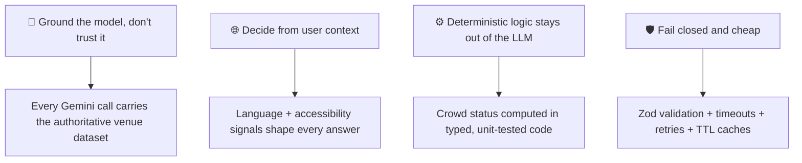
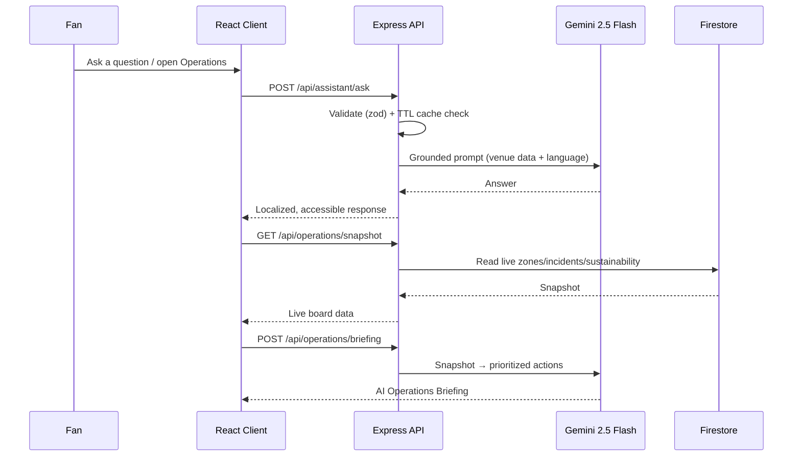
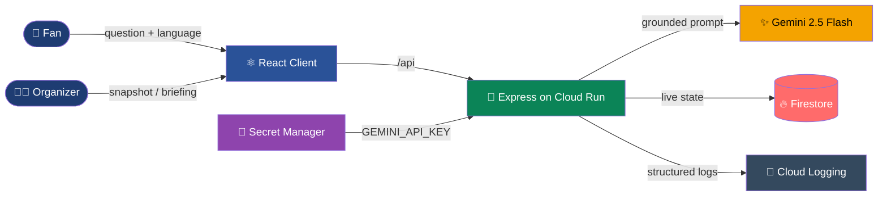

<div align="center">


<br/>

[](https://github.com/code-with-kishan/Smart-Stadiums-Tournament-Operations/actions/workflows/ci.yml)
[](https://github.com/code-with-kishan/Smart-Stadiums-Tournament-Operations/actions/workflows/codeql.yml)
[](LICENSE)
[](package.json)
[](#testing)

[](https://github.com/code-with-kishan/Smart-Stadiums-Tournament-Operations/stargazers)
[](https://github.com/code-with-kishan/Smart-Stadiums-Tournament-Operations/network/members)
[](https://github.com/code-with-kishan/Smart-Stadiums-Tournament-Operations/commits)

**🔴 Live Demo:** [stadiumiq-331244069963.asia-south1.run.app](https://stadiumiq-331244069963.asia-south1.run.app)
&nbsp;·&nbsp;
**📦 Repository:** [github.com/code-with-kishan/Smart-Stadiums-Tournament-Operations](https://github.com/code-with-kishan/Smart-Stadiums-Tournament-Operations)
&nbsp;·&nbsp;
**🌍 Region:** `asia-south1`

</div>

---

## 🏟️ Chosen Vertical

> **Smart Stadiums & Tournament Operations** (FIFA World Cup 2026) — one platform, two personas.

<table>
<tr>
<td width="50%" valign="top">

### 🙋 Fans
A multilingual matchday assistant for navigation, accessibility, transport and venue questions.

**Route:** `/assistant`

</td>
<td width="50%" valign="top">

### 🧑‍💼 Organizers / Venue Staff
An operations command center with live crowd density, incidents, sustainability metrics and AI decision support.

**Route:** `/operations`

</td>
</tr>
</table>

---

## 🧠 Approach & Logic



1. **Ground the model, don't trust it** — Every Gemini call carries the authoritative venue dataset (gates, sections, facilities, transport, accessibility routes) and answers only from it. No invented gate numbers at a 90,000-seat venue.
2. **Decide from user context** — Answers adapt to language (5 supported) and lead with step-free/accessible options whenever mobility is mentioned. Briefings read the *current* live snapshot.
3. **Deterministic logic stays out of the LLM** — Crowd status (🟢 comfortable / 🟡 busy / 🔴 critical) is computed from occupancy thresholds in typed, tested code; Gemini only turns state into prioritized recommendations.
4. **Fail closed and cheap** — Zod validates every input, errors map to one sanitized envelope, Gemini calls have timeouts + one retry + TTL caches.

---

## ⚡ How It Works



Full diagrams and lifecycle: [docs/ARCHITECTURE.md](docs/ARCHITECTURE.md)

---

## 📋 Assumptions Made

| Assumption | Detail |
|---|---|
| 🏟️ **Static venue dataset** | Gates, facilities, transport curated in `server/src/features/stadium/`; production would use a venue CMS |
| 📡 **Simulated telemetry** | No live IoT feed — deterministic simulator writes zone/incident/sustainability state to Firestore (`TELEMETRY_SIM_ENABLED=false` to disable) |
| 🔓 **Public kiosk, no accounts** | Both surfaces anonymous & read-only, rate-limited instead of authenticated; ops board would sit behind SSO in production |
| 🌍 **One stadium, five languages** | Single venue + highest-traffic tournament languages (en/es/fr/pt/ar) — both are data, not architecture |

---

## ✅ Problem Statement Alignment

<div align="center">

| # | Theme | How StadiumIQ Delivers | Route |
|:-:|---|---|:-:|
| R1 | 🧭 **Navigation** | Grounded wayfinding — gate-to-section, step-free routes to any facility | `/assistant` |
| R2 | 👥 **Crowd Management** | Per-zone density (🟢/🟡/🔴) + AI briefing recommends redirections | `/operations` |
| R3 | ♿ **Accessibility** | Accessible-route answers + WCAG 2.1 AA interface throughout | `/assistant` + app |
| R4 | 🚌 **Transportation** | Metro, shuttle, bus, parking, rideshare — including accessible options | `/assistant` |
| R5 | 🌱 **Sustainability** | Live meters (waste, energy, water, CO₂) + AI sustainability actions | `/operations` |
| R6 | 🗣️ **Multilingual** | English, Spanish, French, Portuguese, Arabic | `/assistant` |
| R7 | 📊 **Operational Intelligence** | Live auto-refreshing snapshot from Firestore | `/operations` |
| R8 | 🎯 **Real-time Decisions** | "Generate AI Briefing" → prioritized crowd/incident/sustainability actions | `/operations` |

</div>

---

## ✨ Features

- 💬 **Matchday Fan Assistant** (`/assistant`) — multilingual chat grounded on official venue data, quick-action chips, language selector, accessibility-first answers.
- 📈 **Operations Command Center** (`/operations`) — live crowd density, open incidents, sustainability metrics, on-demand **AI Operations Briefing**.

---

## 🏗️ Architecture

<div align="center">



</div>

<details>
<summary><b>📁 Click to expand full folder structure</b></summary>

```text
stadiumiq/
├── server/                       Node 22 · Express 5 · TypeScript
│   └── src/
│       ├── config/                env (zod-validated) + constants
│       ├── lib/                   firestore · gemini · logger · app-error · ttl-cache
│       ├── middleware/            error-handler · validate(zod) · rate-limit
│       │                          · security(helmet + security.txt) · static-client
│       └── features/
│           ├── stadium/           venue grounding data + facilities API
│           ├── assistant/         multilingual grounded Q&A (Gemini)
│           └── operations/        live snapshot, telemetry sim, AI briefing
├── client/                        React 19 · TypeScript · Vite
│   └── src/
│       ├── components/            AppLayout · ErrorBoundary · StatusMessage
│       ├── lib/                   typed API client
│       └── features/
│           ├── home/              landing page
│           ├── assistant/         AssistantPage + hook + sub-components
│           └── operations/        OperationsPage + hook + sub-components
├── docs/decisions.md              architecture decision records
├── scripts/preflight.sh           pre-submission audit
└── Dockerfile                     multi-stage build → single Cloud Run service
```

</details>

### 🔌 API

| Method + Path | Purpose |
|---|---|
| `GET /api/health` | Liveness + version |
| `GET /api/stadium/facilities?category=` | Venue facilities for quick actions |
| `POST /api/assistant/ask` | Grounded, multilingual answer (Gemini) |
| `GET /api/operations/snapshot` | Live zones, incidents, sustainability |
| `POST /api/operations/briefing` | AI operations briefing (Gemini) |

---

## 🛠️ Tech Stack

<div align="center">


</div>

Also: React Router 7 · Helmet · Pino · Testing Library · Stryker · Secret Manager · Cloud Logging.

📖 Contributors: [CONTRIBUTING.md](CONTRIBUTING.md) &nbsp;·&nbsp; Architecture: [docs/ARCHITECTURE.md](docs/ARCHITECTURE.md) &nbsp;·&nbsp; Decisions: [docs/decisions.md](docs/decisions.md)

---

## 🚀 Getting Started

```bash
# 1️⃣ Install (npm workspaces)
npm install

# 2️⃣ Configure environment
cp .env.example .env      # add your GEMINI_API_KEY

# 3️⃣ Run API (:8080) and client (:5173) in two terminals
npm run dev:server
npm run dev:client
```

<div align="center">

`build` · `lint` · `typecheck` · `test` · `test:coverage` · `test:e2e` · `test:mutation` · `format`

</div>

---

## 🧪 Testing

<div align="center">


</div>

Run `npm run test:coverage`. Coverage thresholds (95% lines/functions/branches/statements) are enforced per-workspace; CI fails on regression.

<details>
<summary><b>🖥️ Server — 87 tests, 100% line coverage</b></summary>

Unit tests for env validation, the TTL cache, the `AppError` type, the Gemini client (success, retry, sanitized failure), crowd/density logic, every middleware (validation, error handling, static/SPA serving), and all feature services; zod boundary tests; full supertest integration tests covering every route, validation rejections, the sanitized 502 path, hardened security headers, and `/.well-known/security.txt`; plus a full matchday-journey test (health → venue → facilities → grounded answer → snapshot → briefing). Firestore is faked in-memory, Gemini is mocked.

</details>

<details>
<summary><b>💻 Client — 32 tests, 100% line coverage</b></summary>

Testing Library tests for the full assistant flow (typed question, quick action, language passthrough, error state), the operations dashboard (live render, accessible density meters, snapshot error, briefing generation, in-flight double-request guard), lazy-loaded routing, the typed API client's error envelope handling, and the error boundary.

</details>

<details>
<summary><b>🎭 End-to-End — Playwright + axe-core</b></summary>

Headless-Chromium smoke tests drive the critical fan-assistant and operations flows against the built client with the API mocked at the network boundary (`npm run test:e2e`) — hermetic in CI. Every flow ends with an **axe-core WCAG 2.1 A/AA scan**. A separate read-only live suite (`E2E_BASE_URL=<url> npm run test:e2e:live`) smoke-tests the deployed Cloud Run URL after each release.

</details>

<details>
<summary><b>🧬 Mutation Testing — Stryker, ~91% score</b></summary>

`npm run test:mutation` verifies the suite actually catches regressions rather than merely executing lines. Scoped to pure, deterministic domain logic (crowd/telemetry math, TTL cache, error model, async plumbing); I/O-bound services/routes are covered by supertest instead. Runs on its own non-blocking schedule.

</details>

---

## 🔒 Security

See [SECURITY.md](SECURITY.md) for the full threat model.

| Layer | Protection |
|---|---|
| 🔑 **Secrets** | Google Secret Manager, mounted via `--set-secrets` — nothing sensitive in repo/image/history; CI runs gitleaks |
| 🧾 **Input validation** | Strict zod schemas at every boundary, unknown keys rejected, length-capped inputs |
| 🛡️ **HTTP hardening** | Helmet CSP, explicit CORS allowlist, 100 kB body limit, layered rate limits |
| 🚨 **Error hygiene** | One central handler, sanitized `{ code, message }` responses, stack traces server-side only |
| 📦 **Supply chain** | `npm audit --omit=dev --audit-level=high` → 0 vulns in CI; Dependabot weekly PRs |
| 🔍 **Static analysis** | CodeQL (`security-extended`) on every push/PR + weekly |
| 🔐 **Least privilege** | Every CI workflow requests only `contents: read` |
| 📬 **Disclosure** | [`/.well-known/security.txt`](https://stadiumiq-331244069963.asia-south1.run.app/.well-known/security.txt) (RFC 9116) |

---

## ⚡ Performance

<div align="center">


</div>

- Route-level code splitting → ~78 kB gzip initial JS
- `compression()` + long-lived `Cache-Control` on hashed assets, `no-cache` on the HTML shell
- Module-scope Gemini/Firestore clients reused; timeout + one retry per Gemini call
- In-memory TTL caches for repeated questions/briefings
- `--min-instances=1` → sub-2s warm first response
- **Live API timings:** snapshot ~0.4s · assistant ~1.8s · cached briefing ~0.3s

Full breakdown: [docs/lighthouse-results.md](docs/lighthouse-results.md)

---

## ♿ Accessibility

Built to **WCAG 2.1 AA**, verified with axe-core and Lighthouse.

- ✅ Semantic landmarks, skip link, one `h1` per route
- ✅ Full keyboard operability with visible focus rings
- ✅ Live regions (`aria-live`) announce answers & briefings; density exposed as accessible `meter`
- ✅ Status never colour-only; 4.5:1 contrast; `prefers-reduced-motion` honoured
- ✅ `dir="auto"` + `lang` on every multilingual answer — Arabic renders proper RTL, verified by a dedicated Playwright test
- ✅ `jsx-a11y` lint rules + axe-core scan on every E2E flow
- ✅ **Lighthouse Accessibility 100** on every route

---

## ☁️ Google Cloud Integration

| Service | Role | Where |
|---|---|---|
|  | Hosts the single containerized service (`--min-instances=1`/`--max-instances=3`), `asia-south1` | `Dockerfile` |
|  | Grounded multilingual answers + operations briefings | `server/src/lib/gemini.ts` |
|  | Live operational state — zones, incidents, sustainability | `server/src/lib/firestore.ts` |
|  | Holds `GEMINI_API_KEY` | deploy config |
|  | Structured JSON logs (severity-tagged) | `server/src/lib/logger.ts` |

---

## 🗺️ Evaluation Map

<details>
<summary><b>Click to expand — where each evaluation area is satisfied</b></summary>

| Evaluation Area | Evidence |
|---|---|
| **Code Quality** | Strict TypeScript · type-aware ESLint (`--max-warnings=0`) · Prettier + `.editorconfig` · TSDoc on every export · feature-folder architecture · CONTRIBUTING/CHANGELOG/CODEOWNERS · conventional commits |
| **Security** | SECURITY.md threat model · Secret Manager · zod boundaries · Helmet/CORS/rate limits · gitleaks + npm audit + CodeQL + Dependabot · security.txt |
| **Efficiency** | Code splitting (~78 kB gzip) · compression + cache headers · TTL caches · warm instance · Lighthouse Performance 100 |
| **Testing** | 100% line coverage · unit + integration + E2E + mutation testing, all in CI |
| **Accessibility** | WCAG 2.1 AA · jsx-a11y · axe-core in E2E · Lighthouse Accessibility 100 |
| **Problem Statement Alignment** | R1–R8 traceability table with a live route per requirement |

</details>

---

<div align="center">

## 👥 Team

Built by **Utkarsh Singh Yadav** for Hack2skill PromptWars Virtual — Week 4

Licensed under the [MIT License](LICENSE)


</div>