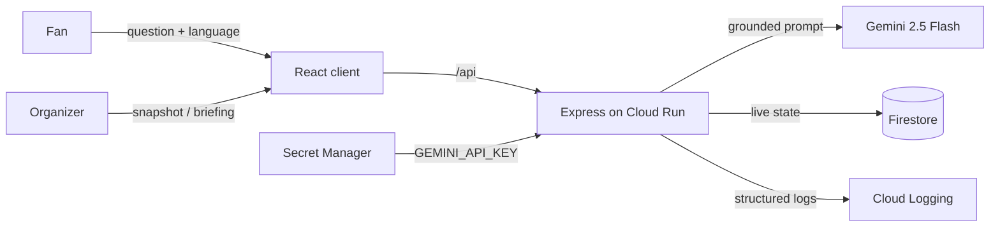

# Architecture

StadiumIQ is a single, layered, inward-pointing system: one Cloud Run service
serves both the API and the built React client. This document describes the
structure and runtime behaviour; the _reasoning_ behind the load-bearing
choices lives in [decisions.md](decisions.md).

## Monorepo layout

npm-workspaces monorepo with two workspaces and a feature-folder convention:

```
server/  Node 22 · Express 5 · TypeScript
  src/
    config/      env (zod-validated, crash-fast) + constants
    lib/         firestore · gemini · logger · app-error · ttl-cache
    middleware/  error-handler · validate(zod) · rate-limit · async-handler
                 · security(helmet + security.txt) · static-client
    features/
      stadium/     venue grounding data + facilities API
      assistant/   multilingual grounded Q&A (Gemini)
      operations/  live snapshot, telemetry sim, AI briefing
  app.ts       composition root (wires middleware + routes)
  index.ts     process entrypoint (listen on PORT)
client/  React 19 · Vite · TypeScript
  src/
    components/  AppLayout · ErrorBoundary · StatusMessage
    lib/         typed fetch API client + shared constants
    features/    home · assistant · operations (page + hook + sub-components)
```

## Layers and dependency direction

Dependencies point inward; nothing lower reaches back up.

```
route handler  ->  feature service  ->  lib / external client (Gemini, Firestore)
     |                    |
   validate(zod)      AppError (thrown)
```

- **Routes** parse/validate input (zod) and dispatch. They contain no logic.
- **Services** hold the business logic and throw `AppError` on failure.
- **lib/** holds pure, reusable utilities and the two module-scoped external
  clients (Gemini, Firestore) reused across requests.
- A single **error middleware** is the only place that turns errors into HTTP
  responses (sanitized `{ code, message }`); handlers never format errors.

## Request lifecycle

1. `securityHeaders()` (Helmet + strict CSP) → CORS allowlist → `compression()`
   → `express.json({ limit })`.
2. `/.well-known/security.txt` and `/api/health` resolve early (before the rate
   limiter, so health checks are never throttled).
3. `apiLimiter` (and a stricter `genAiLimiter` on the two Gemini endpoints).
4. Feature routers validate with zod, then call their service.
5. Services call Gemini/Firestore via module-scoped clients (timeout + one
   retry; in-memory TTL cache for repeated questions and briefings).
6. Unmatched non-API GETs fall through to the SPA shell (`static-client`).
7. Any thrown error funnels into the central error handler.

## Data flow



Firestore holds live operational state (zones, incidents, sustainability). A
server-side telemetry simulator nudges zone densities on an interval so the
operations board is "live"; a real sensor feed is the documented upgrade path
(see [decisions.md](decisions.md), ADR-2).

## Testing strategy

- **Server:** Vitest unit tests for every service/util (happy, edge, error
  paths), zod schema boundary tests, and supertest integration tests for every
  route including validation rejections and the sanitized 502 path. Firestore is
  faked in-memory for hermetic runs; Gemini is mocked.
- **Client:** Testing Library tests for the full assistant and operations flows.
- **E2E:** a Playwright smoke test drives the critical UI flow with the API
  mocked at the network boundary (no external services).
- Coverage thresholds (95%) are enforced in each workspace's Vitest config, so
  CI fails on regression. Stryker mutation testing checks suite strength.

## Deployment

A multi-stage Dockerfile builds the client and server, then copies only `dist`
and production dependencies into a slim `node:22-slim` runtime running as a
non-root user. The exact deploy command:

```bash
gcloud run deploy stadiumiq --source . --region=asia-south1   --min-instances=1 --max-instances=3 --memory=512Mi   --set-secrets=GEMINI_API_KEY=GEMINI_API_KEY:latest --allow-unauthenticated
```

`--min-instances=1` keeps a warm instance for fast first responses;
`--max-instances=3` bounds scale-out so the per-instance Gemini rate limit
caps global spend (see [SECURITY.md](../SECURITY.md)). The Gemini key is
mounted from Secret Manager via `--set-secrets`. Structured JSON logs to
stdout are collected by Cloud Logging.
